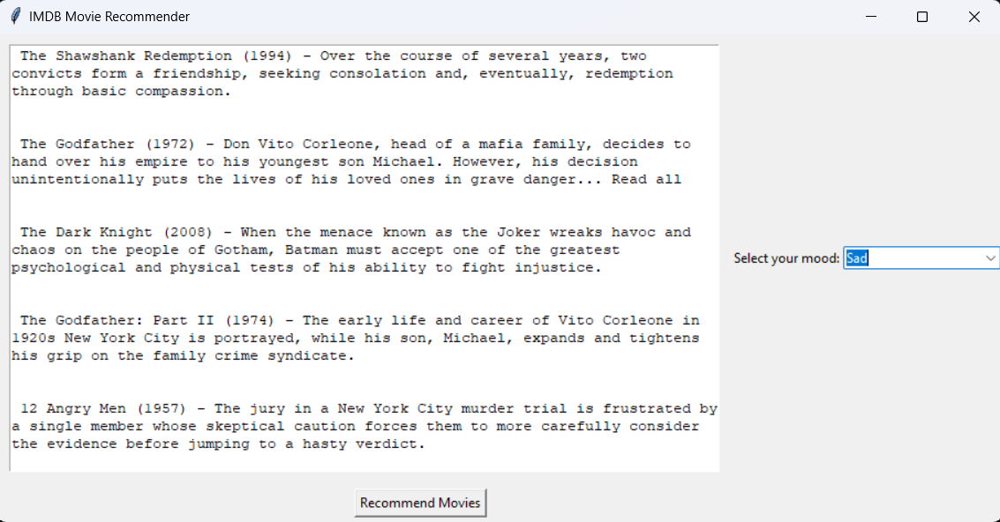

# Movie-recommender based on mood
This is a tool built with Python libraries such as Beautiful Soup and Requests, helping users to find recommendations for movies based on their mood. 

# How this works
Movie list is scraped from the IMDB website, and for each film, the genre is noted. Each mood is matched with some genre, and with this technique, movies based on the requirements are fetched, dynamically. The first five movies are taken for each mood.

# Improvement Plans
The mood analysis can be made better with ML. The next iteration would be incorporating ML into it.
Also, the Tkinter will be replaced by Django or Flask, which would make designing and hosting easier.
A feedback mechanism will also be added in future iterations, which will help the ML model recommend better.

# Libraries Used
<ul>
  <li>Beautiful Soup</li>
  <li>Requests</li>
  <li>Tkinter</li>
</ul>

# How to Run
<ul>
  <li>Clone this repo</li>
  <li>Run the gui.py file</li>
</ul>

